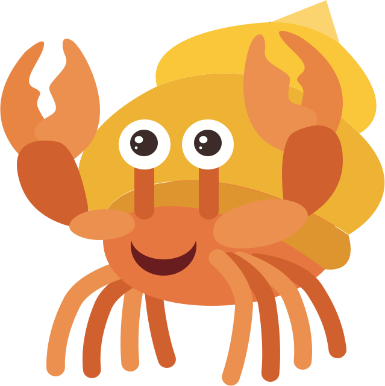

# Hermit - uniform tooling for Linux and Mac
  

Hermit installs tools for software projects in self-contained, isolated sets, so your team, your contributors, and your CI have the same consistent tooling.

See https://cashapp.github.io/hermit for full documentation.

---

Copyright 2021 Square, Inc.

Licensed under the Apache License, Version 2.0 (the "License");
you may not use this file except in compliance with the License.
You may obtain a copy of the License at

http://www.apache.org/licenses/LICENSE-2.0

Unless required by applicable law or agreed to in writing, software
distributed under the License is distributed on an "AS IS" BASIS,
WITHOUT WARRANTIES OR CONDITIONS OF ANY KIND, either express or implied.
See the License for the specific language governing permissions and
limitations under the License.

